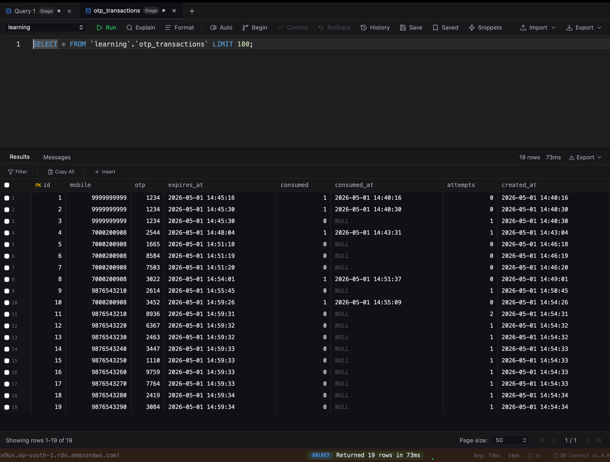
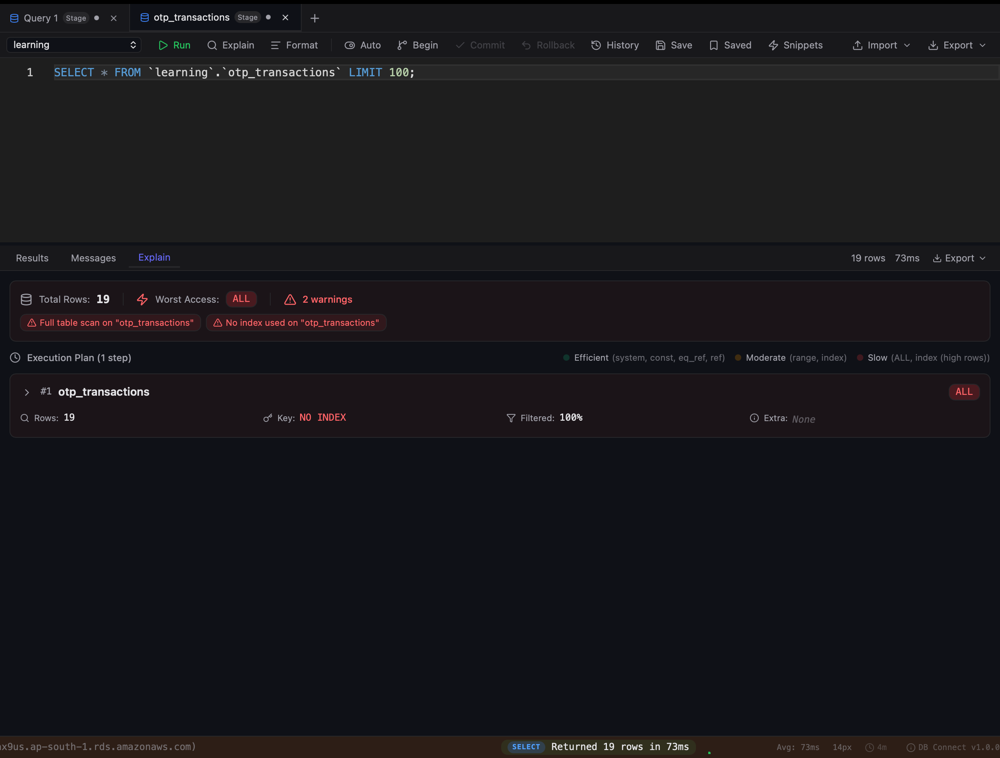
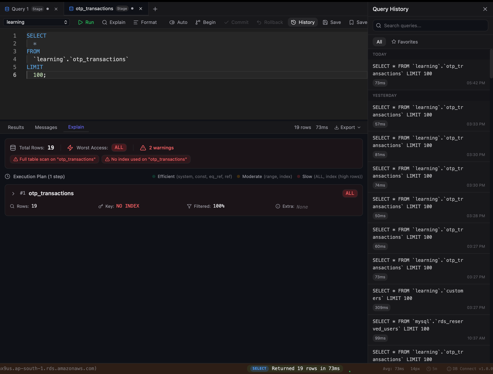
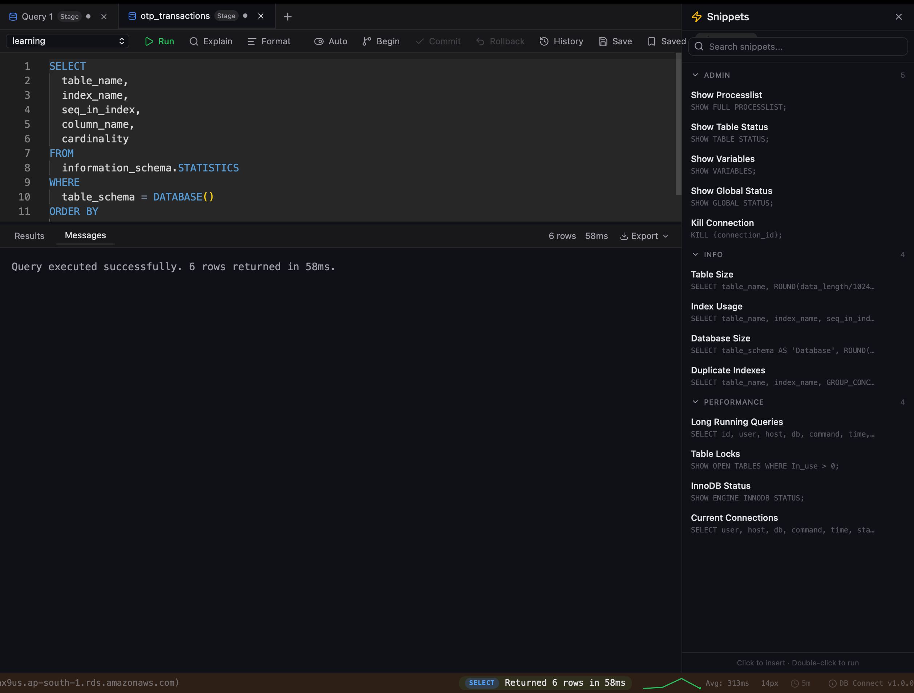

# DB Connect — Free Database GUI Client

A fast, lightweight desktop **database IDE** and **SQL client** for **MySQL**, **Amazon Redshift**, and **AWS DynamoDB (DDB)**.

Free alternative to DataGrip, DBeaver, and TablePlus — built for backend engineers who want a clean, native database tool without bloat.

**DB Connect** is a database management tool with a Monaco-powered SQL editor, schema browser, query history, SSH tunnel support, and DynamoDB visual query builder. Works on macOS and Windows.

   

### Why DB Connect?

- **Free forever** — No subscription, no trial limits
- **Fast startup** — Opens in <2 seconds (unlike DataGrip/DBeaver)
- **Native app** — Not Electron. Truly lightweight (~18MB)
- **DynamoDB first-class** — Visual scan/query builder, not just SQL
- **Secure** — AES-256 encryption, OS keychain, no cloud sync

---

## Screenshots

### SQL Editor with Results Grid


### EXPLAIN Plan Visualization


### Query History


### Built-in SQL Snippets


---

## Features

### Multi-Database Support

| Feature | MySQL | Redshift | DynamoDB |
|---------|:-----:|:--------:|:--------:|
| SQL Query Editor | Yes | Yes | — |
| Schema Browser | Yes | Yes | Yes |
| Autocomplete (tables, columns, keywords) | Yes | Yes | — |
| EXPLAIN Visualization | Yes | Yes | — |
| Inline Row Editing | Yes | Yes | Yes |
| Table Designer (CREATE/ALTER) | Yes | — | — |
| Index Manager | Yes | — | — |
| Transactions (BEGIN/COMMIT/ROLLBACK) | Yes | — | — |
| SSH Tunnel | Yes | — | — |
| Scan / Query / GetItem | — | — | Yes |
| Filter Expression Builder | — | — | Yes |
| Export (CSV, JSON, Excel) | Yes | Yes | Yes |

### Core Features

- **Monaco SQL Editor** — VS Code-quality editing with syntax highlighting, autocomplete, and multi-cursor
- **Multi-Tab / Multi-Connection** — Work across multiple databases simultaneously
- **Command Palette** (Cmd+K) — Quick access to all actions
- **Query History** — Auto-saved with search, favorites, and date grouping
- **Saved Queries** — Named queries with `{{param}}` parameter support
- **Virtual Scrolling** — Handle millions of rows without UI lag
- **Dark Theme** — Easy on the eyes for long sessions
- **Keyboard-First** — Cmd+Enter to run, Cmd+D to select statement, full shortcut coverage

### Security

- Credentials encrypted at rest (AES-256-GCM)
- Encryption key stored in OS keychain (macOS Keychain / Windows Credential Manager)
- No plaintext passwords on disk
- Production safety warnings before destructive queries (DELETE/DROP/TRUNCATE)

### DynamoDB First-Class Support

- Visual Scan/Query/GetItem builder
- Filter expression builder with type-aware inputs
- Item create/edit/delete with full type support (S, N, B, L, M, SS, NS, BS)
- GSI-aware querying
- Multiple auth modes: Access Key, SSO Profile, IAM Role

---

## Download

### macOS

| File | Description |
|------|-------------|
| [DBConnect-macOS.dmg](https://github.com/shubhesh07/db-connect/releases/latest/download/DBConnect-macOS.dmg) | macOS installer (DMG) |
| [DBConnect-mac.zip](https://github.com/shubhesh07/db-connect/releases/latest/download/DBConnect-mac.zip) | macOS portable (ZIP) |

> **⚠️ Important — macOS Gatekeeper Fix**
>
> macOS blocks unsigned apps by default. After installing, you **must** run this command in Terminal before launching:
>
> ```bash
> xattr -cr /Applications/DBConnect.app
> ```
>
> Without this, macOS will show **"DBConnect is damaged and can't be opened"** or silently refuse to launch.
> This is a one-time fix — the app will open normally after.

### Windows

| File | Description |
|------|-------------|
| [DBConnect-Windows-Setup.exe](https://github.com/shubhesh07/db-connect/releases/latest/download/DBConnect-Windows-Setup.exe) | Windows installer (NSIS) |
| [DBConnect-Windows.zip](https://github.com/shubhesh07/db-connect/releases/latest/download/DBConnect-Windows.zip) | Windows portable (ZIP) |

---

## Quick Start

1. Download and install for your platform
2. Launch DB Connect
3. Click "Add Connection" → Choose MySQL, Redshift, or DynamoDB
4. Enter credentials → Test Connection → Save
5. Start querying

### Keyboard Shortcuts

| Shortcut | Action |
|----------|--------|
| `Cmd+Enter` | Execute query |
| `Cmd+D` | Select current statement |
| `Cmd+K` | Command palette |
| `Cmd+T` | New tab |
| `Cmd+W` | Close tab |
| `Cmd+S` | Save query |
| `Cmd+Shift+F` | Format SQL |
| `Cmd+E` | EXPLAIN current query |

---

## Data Storage

All data stored locally at `~/.querypilot/`:

| File | Purpose |
|------|---------|
| `connections.enc` | Encrypted connection profiles |
| `history.db` | Query execution history |
| `saved_queries.db` | Named saved queries |

No telemetry. No cloud sync. Everything stays on your machine.

---

## Requirements

- **macOS:** 11.0 (Big Sur) or later
- **Windows:** Windows 10 or later (64-bit)

---

## Roadmap

- [ ] PostgreSQL support
- [ ] MongoDB support
- [ ] Query result diffing
- [ ] ER diagram visualization
- [ ] Linux build
- [ ] Import/export connection profiles

---

## Author

**Shubhesh Shukla**
- [LinkedIn](https://linkedin.com/in/shubheshshukla7)
- [GitHub](https://github.com/shubhesh07)

---

## License

Free for personal and commercial use. Source code is not open source.

---

## Comparison

| Feature | DB Connect | DataGrip | DBeaver | TablePlus |
|---------|:----------:|:--------:|:-------:|:---------:|
| Price | Free | $25/mo | Free (Community) | $89 |
| DynamoDB Support | Yes | No | No | Yes |
| Redshift Support | Yes | Yes | Yes | Yes |
| Startup Time | <2s | 10-30s | 5-15s | <3s |
| App Size | ~18MB | ~800MB | ~400MB | ~80MB |
| SSH Tunnels | Yes | Yes | Yes | Yes |
| Encrypted Credentials | Yes (AES-256) | Yes | Yes | Yes |
| Offline / No Telemetry | Yes | No | No | No |

---

## Keywords

`mysql client` `mysql gui` `mysql ide` `database tool` `sql editor` `dynamodb gui` `dynamodb client` `ddb client` `aws dynamodb tool` `redshift client` `redshift gui` `redshift query tool` `free database client` `database ide` `sql client mac` `sql client windows` `datagrip alternative` `dbeaver alternative` `tableplus alternative` `database management tool` `query editor` `schema browser`
