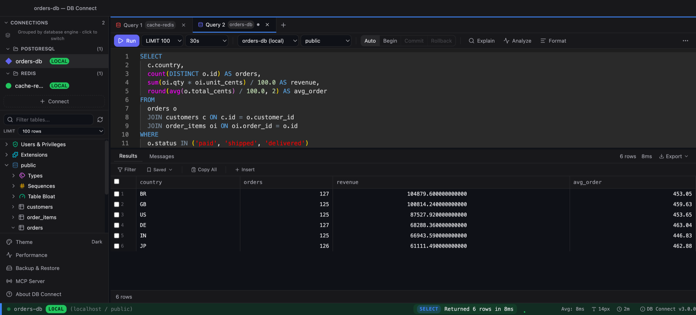
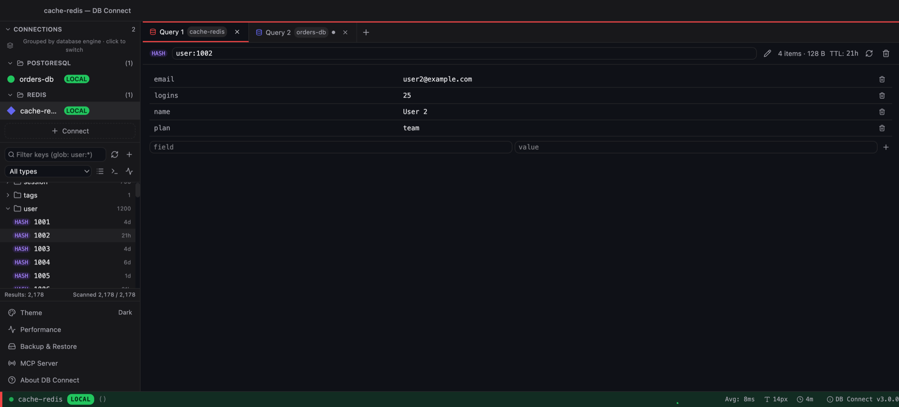
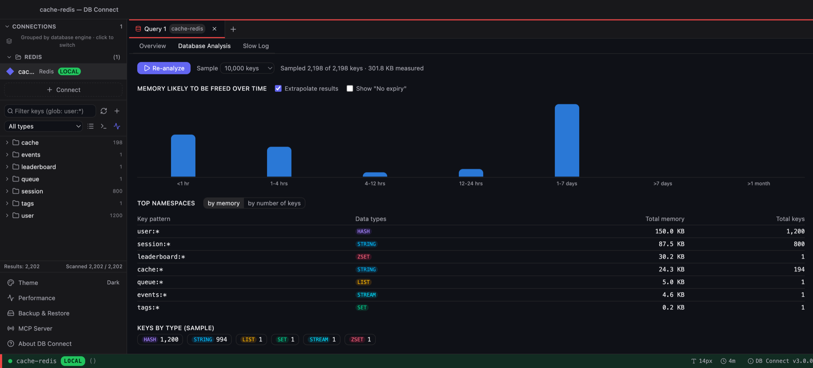
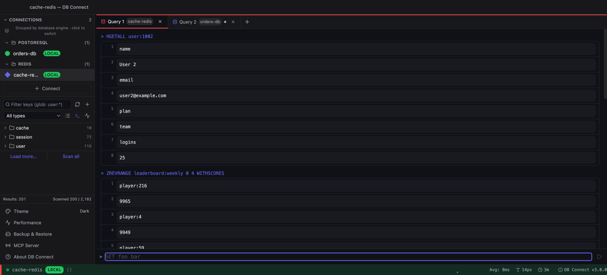
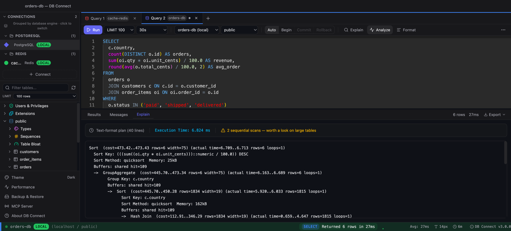

# DB Connect

**One database client for your entire backend stack.**

MySQL + PostgreSQL + Amazon Redshift + DynamoDB + Redis + MongoDB — one fast, free, native desktop IDE instead of five separate tools and five separate sets of saved credentials.

   



## Download

| | |
|---|---|
| **macOS** (recommended: Homebrew) | `brew install --cask shubhesh07/db-connect/db-connect` |
| **macOS** (no Homebrew) | `curl -fsSL https://github.com/shubhesh07/db-connect/releases/latest/download/install.sh \| bash` |
| **Windows** | [Download DBConnect-Windows-Setup.exe](https://github.com/shubhesh07/db-connect/releases/latest/download/DBConnect-Windows-Setup.exe) |

Full manual-download links (DMG, portable ZIPs) are in [Manual downloads](#manual-downloads) below.

## Why DB Connect?

- **One tool, not three.** If your stack is MySQL or PostgreSQL for transactional data, Redshift for analytics, DynamoDB for high-throughput key-value access and Redis for caching, you know the pain of five GUI clients, five credential stores, and five query histories. DB Connect treats all five as equal, first-class citizens.
- **Free forever.** No subscription, no trial limits, no feature paywall.
- **Fast.** Opens in under 2 seconds. 18MB installed. Built with Go + Wails — a native app, not Electron, so there's no bundled Chromium sitting in your dock for a database browser.
- **DynamoDB done properly.** A visual Scan/Query/GetItem builder *and* a PartiQL editor for writing real `SELECT * FROM "table" WHERE ...` statements — most GUI database tools ignore DynamoDB entirely or bolt on a bare-bones table browser.
- **Built to work with your AI coding tools.** A local MCP server lets Claude Code, Cursor, or any MCP-aware client query your already-open connections directly — schema, read-only queries, gated behind a per-install auth token, an explicit connection allow-list, and time-bounded write grants.
- **No cloud sync, no telemetry.** Credentials are AES-256-GCM encrypted with the key in your OS keychain. Nothing you connect to or query ever leaves your machine.

## MySQL · Redshift · DynamoDB

| | MySQL | Redshift | DynamoDB |
|---|---|---|---|
| SQL query editor | ✅ | ✅ | — |
| PartiQL query editor | — | — | ✅ |
| Visual Scan/Query/GetItem builder | — | — | ✅ |
| Schema/table browser | ✅ | ✅ | ✅ |
| Context-aware autocomplete | ✅ | ✅ | ✅ (keywords, tables, per-table attributes) |
| EXPLAIN visualization | ✅ | ✅ | — |
| Inline row editing | ✅ | ✅ | ✅ (item editor) |
| Table designer (CREATE/ALTER) | ✅ | — | — |
| Index manager | ✅ | — | — |
| Transactions | ✅ | — | — |
| SSH tunnel | ✅ | — | — |
| GSI-aware querying | — | — | ✅ |
| Multiple AWS auth modes (access key, SSO profile, IAM role) | — | — | ✅ |
| Real backup/restore (`mysqldump`) | ✅ | ✅ | — |
| Native performance monitoring | ✅ | ✅ | ✅ (capacity/throttle, no CloudWatch) |
| Export (CSV, JSON, Excel) | ✅ | ✅ | ✅ |

## How it compares

| Feature | DB Connect | DBeaver (Community) | DataGrip | TablePlus | Beekeeper Studio (Community) |
|---|:---:|:---:|:---:|:---:|:---:|
| Price | Free | Free | Free (non-commercial) / ~$99 yr¹ (commercial) | $99+ one-time² | Free |
| MySQL | ✅ | ✅ | ✅ | ✅ | ✅ |
| Redshift | ✅ | ✅ | ✅ | ✅ | ✅ |
| DynamoDB | ✅ (PartiQL + visual builder) | — (paid tiers only) | — | — | — (paid tiers only)³ |
| Native app (not JVM/Electron) | ✅ | — | — | ✅ | — |
| Install size | ~18MB | ~400MB | ~800MB | ~80MB | ~500MB |
| Startup time | <2s | 5–15s | 10–30s | <3s | — (Electron) |
| SSH tunnel | ✅ | ✅ | ✅ | ✅ | ✅ |
| Query history (persists across restarts) | ✅ | — (session-only in Community) | ✅ | ✅ | ✅ |
| Real backup/restore | ✅ | — | — | — | ✅ |
| Native performance monitoring | ✅ | — | — | — | — |
| Local MCP server (AI tool integration) | ✅ | — | — | — | — |
| macOS | ✅ | ✅ | ✅ | ✅ | ✅ |
| Windows | ✅ | ✅ | ✅ | ✅ | ✅ |

¹ DataGrip has been free for non-commercial use (learning, hobby, open-source) since October 2025; commercial use still requires a paid license.
² TablePlus's free tier caps open tabs/windows/filters; the one-time license runs $99–$129 depending on device count.
³ Beekeeper Studio's Community edition includes Redshift but gates DynamoDB to its paid Indie/Professional/Business tiers.

*Comparison reflects each product's free/community tier where one exists, verified against each vendor's own docs as of this writing. Corrections welcome — open an issue if something's out of date.*

### vs. popular MySQL-only tools

DB Connect, DBeaver, DataGrip, TablePlus, and Beekeeper Studio above all support multiple database engines. MySQL Workbench and Sequel Ace are two of the most popular *MySQL-only* clients, so they get their own table instead of a row full of dashes above:

| Feature | DB Connect | MySQL Workbench | Sequel Ace |
|---|:---:|:---:|:---:|
| Price | Free | Free (Community) | Free (open source, MIT) |
| MySQL | ✅ | ✅ | ✅ |
| Redshift | ✅ | — | — |
| DynamoDB | ✅ | — | — |
| Native app | ✅ | ✅ | ✅ |
| Platforms | macOS, Windows | macOS, Windows, Linux | macOS only |
| SSH tunnel | ✅ | ✅ | ✅ |
| Query history | ✅ | ✅ (persists across restarts) | ✅ |
| EXPLAIN | ✅ Visual | ✅ Visual | ✅ (text output) |
| Backup/restore | ✅ | ✅ | ✅ (SQL dump-based) |

MySQL Workbench is Oracle's official free tool and a genuinely solid choice if MySQL is the *only* engine you touch — its Visual Explain is long-standing and well-regarded. Sequel Ace (the free, open-source successor to Sequel Pro) is excellent if you're macOS-only and MySQL-only. Neither reaches beyond MySQL/MariaDB, which is the gap DB Connect fills if Redshift or DynamoDB are also in your stack.

## 30-second quick start

```bash
brew install --cask shubhesh07/db-connect/db-connect
```

1. Launch DB Connect
2. **Add Connection** → choose MySQL, PostgreSQL, Redshift, DynamoDB, Redis, or MongoDB
3. Enter credentials → **Test Connection** → **Save**
4. Write a query (or, for DynamoDB, use the visual builder or the PartiQL editor) → `Cmd+Enter` to run

### Keyboard shortcuts

| Shortcut | Action |
|---|---|
| `Cmd+Enter` | Execute query |
| `Cmd+D` | Select current statement |
| `Cmd+K` | Command palette |
| `Cmd+T` / `Cmd+W` | New tab / close tab |
| `Cmd+S` | Save query |
| `Cmd+Shift+F` | Format SQL |
| `Cmd+E` | EXPLAIN current query |

## Security

- Credentials encrypted at rest with **AES-256-GCM**; the encryption key lives in the OS keychain (macOS Keychain / Windows Credential Manager) — never in a plaintext file.
- **No cloud sync.** Connection profiles, query history, and saved queries all stay on your machine (`~/.querypilot/`).
- **No telemetry.**
- Production-safety confirmation before destructive statements (`DELETE`/`DROP`/`TRUNCATE`/`UPDATE`/`ALTER`) on connections you've tagged as production — tiered by severity, not a single dismissible dialog.
- The optional local MCP server (off by default) requires a per-install bearer token, validates Host/Origin on every request, only reaches an explicit connection allow-list, and gates writes behind time-bounded, desktop-UI-only grants — an AI agent reachable via MCP can never grant itself write access.

## Performance

- **Virtual scrolling** — result grids render only visible rows plus a small buffer, so scrolling through hundreds of thousands of rows doesn't choke the DOM.
- **Goroutine-per-query** — every query runs in its own goroutine; a long-running analytics query on Redshift doesn't freeze the UI while you run a quick lookup on another tab.
- **Native binary, no runtime** — no JVM, no Electron/Chromium, no Node runtime. A single Go binary around 32MB (the SQL editor is bundled, no CDN), universal on macOS (Intel + Apple Silicon).

## Screenshots

### MySQL Performance Overview — live rates, health findings, click a metric for the queries behind it


### Redis key browser — keys grouped by `:` prefix, type-aware editors


### Redis analysis — memory by TTL, top namespaces, keys by type


### Redis console — replies rendered by type


### EXPLAIN ANALYZE


## Roadmap

Reordered toward the broadest database-client market first:

1. [x] **PostgreSQL support** — shipped in v2.4.0
1. [x] **Redis support** — shipped in v3.0.0: auto-detected cluster, Visual key browser, Analyze pane, MCP tools. MySQL + PostgreSQL + Redshift + DynamoDB + Redis covers most backend stacks people actually run
2. [ ] **Linux build** — Wails already supports it; needs a packaging/CI pipeline
3. [x] **ER diagram visualization (auto-generated from foreign keys)** — shipped in v3.1.0: right-click a MySQL database or PostgreSQL schema, laid out by foreign-key depth, pan/zoom, click a table to open it
4. [x] **Query result diffing (compare EXPLAIN output before/after an index change)** — shipped in v3.1.0: baseline a plan, change an index, re-run, and compare access type, key and rows examined with a per-table verdict
5. [x] **MongoDB support** — shipped in v3.2.0: SQL (translated to find/aggregate) or mongosh syntax, collection explorer with sampled fields, production/read-only gating, MCP tools
6. [ ] Import/export connection profiles

## FAQ

**Is this actually free, or free-with-a-catch?**
Free for personal and commercial use, no subscription, no feature paywall, no account required. Source code is not open source (see [License](#license)).

**Why not just use DBeaver — it's free too?**
DBeaver Community is a solid generalist tool, but it's Java/Eclipse-based (slower startup, heavier footprint) and its DynamoDB support sits behind the paid tiers (Lite and above) — it's not in the free Community edition. DB Connect is built specifically around MySQL + Redshift + DynamoDB as equal citizens, starts in under 2 seconds, and is 18MB installed.

**Does DynamoDB support mean real SQL-like querying, or just a table browser?**
Both. There's a visual Scan/Query/GetItem builder for form-based filtering, and a PartiQL editor for writing `SELECT * FROM "table" WHERE ...` directly via AWS's native PartiQL support — with autocomplete that learns each table's attributes as you query it.

**Does the AI/MCP integration send my data anywhere?**
No. The MCP server is off by default, binds to `127.0.0.1` only, requires a bearer token, and only ever reaches connections you've explicitly allow-listed. It never dials a new connection and never returns credentials.

**Is my data or credentials ever synced to a cloud account?**
No. There's no account, no cloud sync, and no telemetry. Everything lives in `~/.querypilot/` on your machine.

**What platforms are supported?**
macOS 11.0+ (Intel & Apple Silicon) and Windows 10+ (64-bit) today. Linux is next on the roadmap.

**I found a bug / want a feature.**
Open an issue on GitHub — see [Author](#author) below.

---

## Manual downloads

### macOS

| File | Description |
|------|-------------|
| [DBConnect-macOS.dmg](https://github.com/shubhesh07/db-connect/releases/latest/download/DBConnect-macOS.dmg) | macOS installer (DMG) |
| [DBConnect-mac.zip](https://github.com/shubhesh07/db-connect/releases/latest/download/DBConnect-mac.zip) | macOS portable (ZIP) |

> If you downloaded the DMG manually and see **"DBConnect is damaged and can't be opened"**, run this once in Terminal:
>
> ```bash
> xattr -cr /Applications/DBConnect.app
> ```
>
> Or open the DMG and double-click the bundled `install-mac.sh` — it does the same thing for you.

### Windows

| File | Description |
|------|-------------|
| [DBConnect-Windows-Setup.exe](https://github.com/shubhesh07/db-connect/releases/latest/download/DBConnect-Windows-Setup.exe) | Windows installer (NSIS) |
| [DBConnect-Windows.zip](https://github.com/shubhesh07/db-connect/releases/latest/download/DBConnect-Windows.zip) | Windows portable (ZIP) |

## Data storage

All data stored locally at `~/.querypilot/`:

| File | Purpose |
|------|---------|
| `connections.enc` | Encrypted connection profiles |
| `history.db` | Query execution history |
| `saved_queries.db` | Named saved queries |

## Requirements

- **macOS:** 11.0 (Big Sur) or later
- **Windows:** Windows 10 or later (64-bit)

## Writing

- [DB Connect: a database IDE that lets your AI assistant actually query your database](https://dev.to/shubhesh07/-db-connect-a-database-ide-that-lets-your-ai-assistant-actually-query-your-database-4ea5) — the v2.2.0 launch post, on the MCP integration and why it's built with Go + Wails instead of Electron.

## Author

**Shubhesh Shukla**
- [LinkedIn](https://linkedin.com/in/shubheshshukla7)
- [GitHub](https://github.com/shubhesh07)

## License

Free for personal and commercial use. Source code is not open source.

## Keywords

`mysql client` `mysql gui` `mysql ide` `database tool` `sql editor` `dynamodb gui` `dynamodb client` `ddb client` `aws dynamodb tool` `redshift client` `redshift gui` `redshift query tool` `free database client` `database ide` `sql client mac` `sql client windows` `datagrip alternative` `dbeaver alternative` `tableplus alternative` `database management tool` `query editor` `schema browser`
